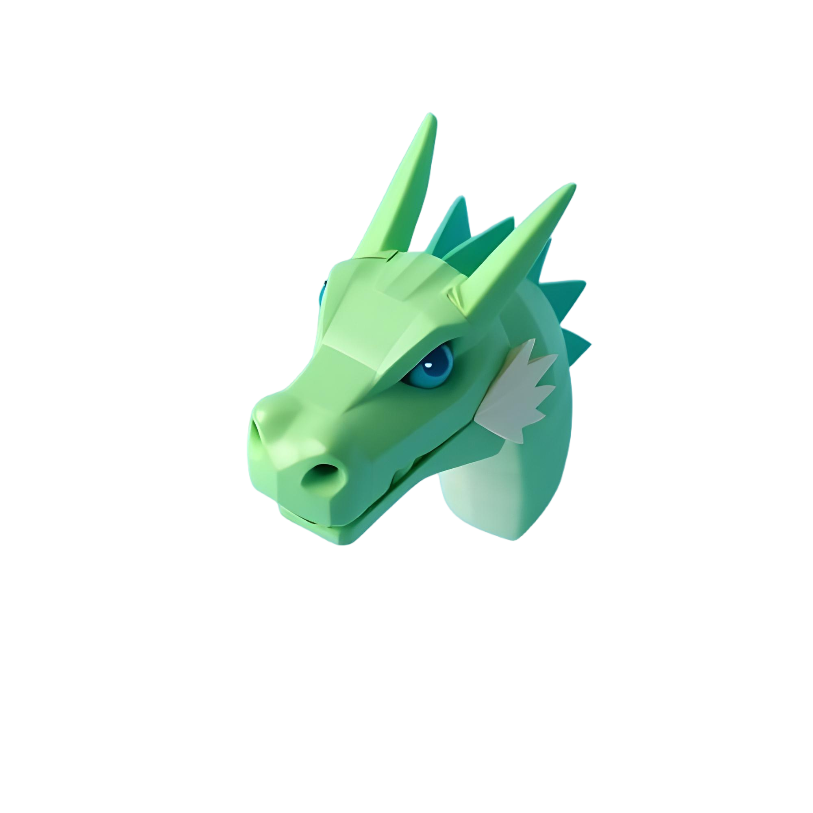

# DragNN 🐉
### Drag and Drop app for building NN
A simple app where you can drag and drop various components to create a Neural Network and train it for your task!

### Libraries used:
*   Pytorch
*   Tkinter

### Made By:
Guilherme Ribeiro - [LinkedIn](https://www.linkedin.com/in/guilherme-ribeiro0328/)
